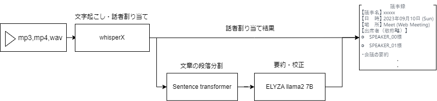
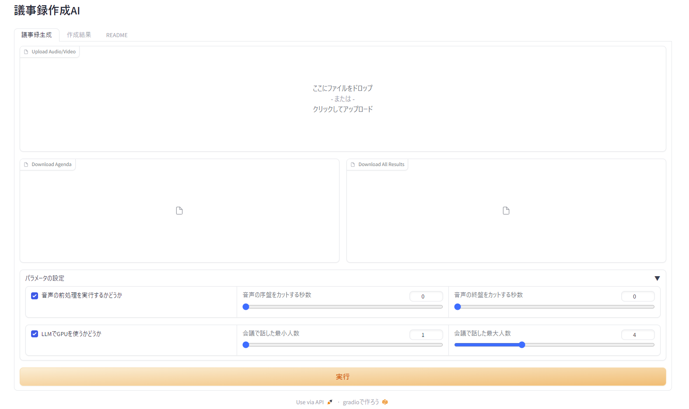

# 議事録生成AI



[](https://colab.research.google.com/drive/1C4h68lQ3NLDVkbci1rruF9Bn2V_bIzdd?usp=sharing)

動画や音声データを入力として、文字起こし、話者割り当てと要約の結果を出力します。

## 概要
このプロジェクトは、音声・動画データから議事録を自動生成するためのライブラリです。具体的には、音声データから文字起こし、話者割り当て、テキストセグメンテーション、要約を行い、最終的には生成された議事録を出力します。

## 特徴

* 文字起こし：WhisperXを使用して、音声データからテキストへの変換を行います。
* 話者割り当て：WhisperXを使用して、音声データから話者を自動的に分離します。
* テキストセグメンテーション：SentenceTransformerを使用して、テキストを段落に分割します。
* 要約：LLama2 ELYZAを使用して、生成されたテキストを要約します。
* 文書校正：LLama2 ELYZAを使用して、生成されたテキストを文章校正します。

## 使い方
#### 実行方法
基本的にpath_inputにwav,mp3,mp4形式のデータのパスを渡すことで議事録の生成が可能です。

* コマンドラインで実行する場合
  - agenda path_input = "入力ファイルのパス"
  - path_output="出力先のパス" 
  - config_path = "パラメーター各種のyamlファイルのパス"

## 実行環境

- OS: Ubuntu20.04
- CPU: Rythen7 3700X
- GPU: GEFORCE RTX2070 SUPER(8GB)
- MEMORY: 32GB


※上記実行環境で、約37分のmp3ファイルから議事録を生成するのにかかる時間は**約7分**
## 環境構築

### Dockerを使う場合
make, dockerが必要です。

* make version

```
GNU Make 4.2.1
Built for x86_64-pc-linux-gnu
Copyright (C) 1988-2016 Free Software Foundation, Inc.
License GPLv3+: GNU GPL version 3 or later <http://gnu.org/licenses/gpl.html>
This is free software: you are free to change and redistribute it.
There is NO WARRANTY, to the extent permitted by law.
```

* docker version
```
Docker version 24.0.5, build ced0996
```

#### 1. HF_TOKENの設定

.env内にHF_TOKENを入力してください。

```.env
HF_TOKEN =hf_xxxx
```

#### 2. モデルのダウンロード
以下のコマンドでモデルをダウンロード

```
make prepare
```

#### 3. コンテナビルド
以下のコマンドでモデルをダウンロード

```
make start
```

#### 4. コンテナクローズ
以下のコマンドでdockerを終了してキャッシュを削除
```
make stop
make clear
```

### ローカルで環境構築する場合
#### 1. 事前準備
* Python 3.10のインストール
本ライブラリはPython 3.10系でのみ実行確認をしています。

* FFmpegのインストール
Whisperxの使用や音声データの加工をするために必要です。

* Hugging Faceアカウント
各種モデルをHugging Face Hubからインストールするために使用します。ログインできれば問題ありません。

**HF_TOKEN**を取得するために使用します。
#### 2. 必要なライブラリのインストール
以下のコマンドでpoetry.lockから依存関係をインストール
```
poetry config installer.max-workers 10
poetry install --no-interaction --no-ansi -vvv
```
* llama-cpp-pythonのインストール
  - CPUを使う場合

  ```
  CMAKE_ARGS="-DLLAMA_BLAS=ON -DLLAMA_BLAS_VENDOR=OpenBLAS" FORCE_CMAKE=1 pip install llama-cpp-python==0.1.83 --no-cache-dir
  ```
  - GPUを使う場合

  ```
  CMAKE_ARGS="-DLLAMA_CUBLAS=on" FORCE_CMAKE=1 python3 -m pip install llama-cpp-python==0.1.83 --no-cache-dir
  ```
## 実行方法

実行方法は、CLIで実行する方法とgradioを起動する方法の2つあります。

### CLIで実行する方法

以下のコマンドで実行可能

```
python agenda_maker/cli.py
```

引数は、以下のものを使用
```
options:
  -h, --help            show this help message and exit
  -config CONFIG_PATH, --config_path CONFIG_PATH
  -input INPUT_PATH, --input_path INPUT_PATH(mp3 or mp4 or wav)
  -output OUTPUT_NAME, --output_name OUTPUT_NAME
```
※config.yamlの各項目は`doc/config.md`をご参照ください。


### gradioを起動する方法

以下のコマンドでgradioを起動

```
python agenda_maker/app.py --share False --is_auth False
```
引数は以下のものを使用可能
以下の引数は、gradioのlunchで使用する引数を参照にしてください。

```
options:
  -h, --help            show this help message and exit
  -pass PASSWORD, --password PASSWORD
  -id USER_ID, --user_id USER_ID
  -share SHARE, --share SHARE
  -inl INLINE, --inline INLINE
  -auth IS_AUTH, --is_auth IS_AUTH
  -queue ENABLE_QUEUE, --enable_queue ENABLE_QUEUE
  -port PORT, --port PORT
```

ローカルホストでアクセスすると以下の画面が出てくる。




## 使用モデル

| モデル | リンク | 商標利用 | ライセンス |
| --- | --- | --- | --- |
|whisper X| https://github.com/m-bain/whisperX/tree/main | 可 |BSD 4-Clause "Original" or "Old" License|
| pkshatech/simcse-ja-bert-base-clcmlp | https://huggingface.co/pkshatech/GLuCoSE-base-ja | 可 | apach2.0|
| ELYZA-Llama 2 7B GGUF | https://huggingface.co/mmnga/ELYZA-japanese-Llama-2-7b-fast-instruct-gguf | 可 |　llama 2 |
## 免責事項

この製品は、Max Bain によって開発されたソフトウェアを含んでいます。

## 作成者

* jumtras
